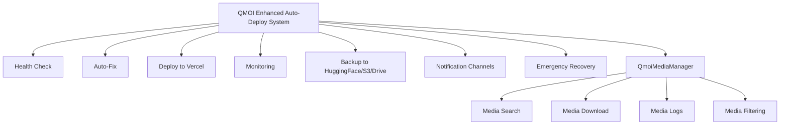

# QMOI Enhanced Auto-Deploy System

## Overview

The QMOI Enhanced Auto-Deploy System is a comprehensive deployment solution that automatically handles build, test, and deployment processes with intelligent error detection and auto-fixing capabilities.

---



*Diagram: QMOI Enhanced Auto-Deploy System architecture, including the new Media Manager module.*

---

## Features

- 🤖 **AI-Powered Error Detection**: Automatically identifies and fixes common deployment issues
- 🔄 **Multi-Strategy Deployment**: Multiple fallback strategies for Vercel deployment
- 🏥 **Health Monitoring**: Continuous monitoring of deployment health
- 🔧 **Auto-Fix Capabilities**: Automatically fixes build, test, and deployment errors
- 📊 **Comprehensive Logging**: Detailed logs for debugging and monitoring
- 🔔 **Multi-Channel Notifications**: WhatsApp, Slack, Discord, and email notifications

## Quick Start

### 1. Environment Setup

Ensure you have the following environment variables set:

```bash
# Vercel Configuration
VERCEL_TOKEN=your_vercel_token
VERCEL_ORG_ID=your_org_id
VERCEL_PROJECT_ID=your_project_id

# GitHub Actions Secrets
GITHUB_TOKEN=your_github_token
VERCEL_DEPLOY_URL=your_deployment_url
```

### 2. Manual Deployment

```bash
# Health check
npm run deploy:health

# Auto-fix issues
npm run deploy:fix

# Deploy to Vercel
npm run deploy:vercel

# Full deployment with monitoring
npm run deploy:monitor
```

### 3. GitHub Actions

The system includes enhanced GitHub Actions workflows:

- **`.github/workflows/auto-deploy.yml`**: Main deployment workflow
- **`.github/workflows/qmoi-autodev.yml`**: Auto-development workflow

## Deployment Scripts

### Health Check Script (`scripts/deploy/health-check.js`)

Comprehensive health monitoring for your deployment:

```bash
# Run full health check
node scripts/deploy/health-check.js check

# Apply auto-fixes
node scripts/deploy/health-check.js fix

# Check only Vercel deployment
node scripts/deploy/health-check.js vercel
```

**Health Check Areas:**
- ✅ Vercel deployment status
- ✅ Build directory integrity
- ✅ Environment configuration
- ✅ Dependencies validation

### Enhanced Error Fix Script (`scripts/enhanced-error-fix.js`)

AI-powered error detection and fixing:

```bash
# Fix specific error types
node scripts/enhanced-error-fix.js --type=build
node scripts/enhanced-error-fix.js --type=vercel
node scripts/enhanced-error-fix.js --type=test
node scripts/enhanced-error-fix.js --type=lint

# Comprehensive fix
node scripts/enhanced-error-fix.js --type=comprehensive
```

**Error Types Supported:**
- `build`: Build process errors
- `vercel`: Vercel deployment errors
- `test`: Test failures
- `lint`: Linting issues
- `license`: License compliance issues

### Vercel Auto-Deploy Script (`scripts/deploy/vercel_auto_deploy.js`)

Enhanced Vercel deployment with retry logic:

```bash
node scripts/deploy/vercel_auto_deploy.js
```

**Features:**
- 🔄 Automatic retry with exponential backoff
- 🧹 Cache clearing and cleanup
- 🔧 Multiple deployment strategies
- 📊 Health monitoring and rollback

## Configuration Files

### Vercel Configuration (`vercel.json`)

Enhanced Vercel configuration with:

```json
{
  "version": 2,
  "builds": [
    {
      "src": "package.json",
      "use": "@vercel/static-build",
      "config": {
        "distDir": "build",
        "installCommand": "npm ci --legacy-peer-deps",
        "buildCommand": "npm run build"
      }
    }
  ],
  "env": {
    "NODE_ENV": "production",
    "NEXT_PUBLIC_APP_ENV": "production",
    "QMOI_AUTODEV_ENABLED": "true"
  }
}
```

### Environment Configuration

Create a `.env` file with:

```bash
NODE_ENV=production
NEXT_PUBLIC_APP_ENV=production
QMOI_AUTODEV_ENABLED=true
```

## Troubleshooting

### Common Issues

#### 1. Build Failures

**Symptoms:**
- Build directory missing or empty
- TypeScript compilation errors
- Missing dependencies

**Solutions:**
```bash
# Clear cache and reinstall
npm cache clean --force
rm -rf node_modules package-lock.json
npm ci --legacy-peer-deps

# Run auto-fix
npm run deploy:fix
```

#### 2. Vercel Deployment Failures

**Symptoms:**
- Deployment timeout
- Build errors on Vercel
- Environment variable issues

**Solutions:**
```bash
# Clear Vercel cache
npx vercel --clear-cache

# Force redeploy
npx vercel --prod --yes --force

# Check deployment status
npm run deploy:health
```

#### 3. Environment Issues

**Symptoms:**
- Missing environment variables
- Configuration errors

**Solutions:**
```bash
# Validate environment
node scripts/deploy/health-check.js check

# Auto-fix environment
npm run deploy:fix
```

### Debug Mode

Enable debug logging:

```bash
# Set debug environment
export DEBUG=true

# Run with verbose output
npm run deploy:vercel -- --debug
```

### Log Files

Check logs for detailed information:

```bash
# Deployment logs
tail -f logs/vercel_auto_deploy.log

# Health check logs
tail -f logs/deployment-health.log

# Error fix logs
tail -f logs/ai_error_fix.log
```

## Monitoring and Alerts

### Health Monitoring

The system provides continuous health monitoring:

```bash
# Start monitoring
node scripts/deploy/health-check.js check

# Monitor deployment status
npm run deploy:health
```

### Notification Channels

Configure notifications in `test_config.json`:

```json
{
  "notifications": {
    "slack": {
      "enabled": true,
      "webhook_url": "your_slack_webhook"
    },
    "email": {
      "enabled": true,
      "smtp_server": "smtp.gmail.com",
      "sender_email": "your_email@gmail.com",
      "sender_password": "your_password",
      "recipient_emails": ["admin@example.com"]
    }
  }
}
```

## Best Practices

### 1. Pre-Deployment Checklist

- [ ] Run health check: `npm run deploy:health`
- [ ] Fix any issues: `npm run deploy:fix`
- [ ] Test locally: `npm run build && npm start`
- [ ] Verify environment variables

### 2. Deployment Process

1. **Pre-deploy**: Health check and auto-fix
2. **Build**: Enhanced build with error handling
3. **Deploy**: Multi-strategy Vercel deployment
4. **Verify**: Health check and monitoring
5. **Notify**: Multi-channel status notifications

### 3. Post-Deployment

- Monitor deployment health
- Check application functionality
- Review logs for any issues
- Set up continuous monitoring

## Advanced Configuration

### Custom Build Commands

Modify `package.json` scripts:

```json
{
  "scripts": {
    "build": "react-scripts build",
    "vercel-build": "react-scripts build",
    "postbuild": "echo 'Build completed successfully'"
  }
}
```

### Environment-Specific Configurations

Create environment-specific files:

```bash
# Development
.env.development

# Production
.env.production

# Staging
.env.staging
```

### Custom Error Fixes

Extend the error fixing system:

```javascript
// Add custom fix strategies
async function customFixStrategy(error) {
  // Your custom fix logic
}
```

## Support

For issues and questions:

1. Check the logs: `logs/` directory
2. Run health check: `npm run deploy:health`
3. Review this documentation
4. Check GitHub Actions logs

## Contributing

To enhance the deployment system:

1. Follow the existing code structure
2. Add comprehensive logging
3. Include error handling
4. Update this documentation
5. Test thoroughly before deployment

---

**QMOI Enhanced Auto-Deploy System** - Always running, always fixing, always deploying! 🚀 

## Backup Health

[](https://github.com/QMOI/QMOI/actions/workflows/auto-deploy.yml)

> **Backup Health:** This badge shows the status of the latest scheduled backup to HuggingFace. Green = healthy, Red = last backup failed.

## Permanent QMOI Backup to HuggingFace

### How it works
- After every successful deployment, the latest QMOI model/data/code is automatically pushed to [huggingface.co/alphaqmoi/qmoi](https://huggingface.co/alphaqmoi/qmoi).
- Large files are tracked with Git LFS for efficient storage and transfer.

### Manual Backup
```bash
# Track large files
cd /path/to/your/project
export HF_TOKEN=your_huggingface_token
python scripts/hf_sync.py
```

### Automated Backup
- The GitHub Actions workflow runs the sync script after every successful deploy.
- Ensure your HuggingFace token is set as the `HF_TOKEN` secret in your repository.

### S3/Google Drive Mirroring (Optional)
- To also mirror backups to S3, set the `S3_BUCKET` environment variable and provide AWS credentials (`AWS_ACCESS_KEY_ID`, `AWS_SECRET_ACCESS_KEY`).
- To mirror to Google Drive, set the `GOOGLE_DRIVE_FOLDER_ID` environment variable and authenticate with Google (first run will prompt for OAuth).

### Restoring from Backup
```bash
git clone https://huggingface.co/alphaqmoi/qmoi
# or use the HuggingFace Hub API for programmatic access
```

### Permanent Storage & Redundancy
- All releases are pinned on HuggingFace.
- Optionally mirrored to S3/Google Drive for redundancy.

### Advanced: Pinning and Mirroring
- Use HuggingFace's "pin" feature to pin important versions.
- Mirror to another remote (e.g., S3, Google Drive) for extra safety.

---

## Restore from Backup

### HuggingFace
```bash
git clone https://huggingface.co/alphaqmoi/qmoi
```

### S3
```bash
export S3_BUCKET=your-bucket
python scripts/restore_from_s3.py
```

### Google Drive
```bash
export GOOGLE_DRIVE_FOLDER_ID=your-folder-id
python scripts/restore_from_gdrive.py
```

---

## Automated Notifications
- Set these environment variables to enable alerts on backup failure:
  - `SLACK_WEBHOOK_URL` for Slack
  - `EMAIL_SMTP`, `EMAIL_TO`, `EMAIL_FROM`, `EMAIL_PASS` for email
  - `WHATSAPP_API_URL`, `WHATSAPP_TO` for WhatsApp

---

## Advanced: Config Auto-Fix & Health Checks
- The self-healing system now:
  - Detects and fixes typos and missing fields in `vercel.json`, `package.json`, and `.env`.
  - Auto-commits and pushes fixes.
  - Validates JSON structure and removes trailing commas.
  - Removes duplicate keys in `.env`.

---

## Secure Environment Variable Management

- Store all production secrets (M-Pesa number, credentials) in `.env.production`.
- Ensure `.env.production` is in `.gitignore`.
- Reference secrets in code via `process.env`.
- For credential rotation, update `.env.production` and restart the deployment.
- Optionally, encrypt and back up `.env.production` to a secure, non-git location.

## QMOI Auto-Configuration System

### Automatic Setup

```bash
# Run auto-configuration
npm run qmoi:autoconfig

# This will:
# - Generate security credentials using "Victor9798!" initiator password
# - Create .env.production with all required variables
# - Test M-Pesa API connectivity
# - Validate configuration
# - Set up enhanced revenue targets
```

### Enhanced Revenue Targets

- **Daily Target**: 10,000 KES (increased from 5,000 KES)
- **Auto-Transfer**: 2,000 KES automatically sent to M-Pesa daily
- **Growth Target**: 20% daily growth (each day exceeds previous day)
- **Minimum Guarantee**: QMOI ensures it never makes less than target

### Auto-Deployment Commands

```bash
# Full auto-deployment with error fixing
npm run qmoi:autodev:deploy

# Auto-configuration and setup
npm run qmoi:autoconfig

# Start enhanced revenue engine
npm run revenue:start

# Check revenue status
npm run revenue:status
```

## Enhanced Automation

### Self-Healing System
- **Error Detection**: Automatically identifies and fixes issues
- **GitHub Integration**: Automatic commits and deployments
- **Error Recovery**: Continuous monitoring and auto-recovery
- **Performance Optimization**: Real-time strategy adjustment

### Revenue Guarantees

- **Daily Minimum**: 10,000 KES guaranteed
- **Auto-Transfer**: 2,000 KES to M-Pesa daily
- **Growth Target**: 20% increase each day
- **Continuous Operation**: 24/7 revenue generation 

## Advanced Revenue Features

### QMOI Revenue Engine

The QMOI system includes an advanced revenue generation engine with guaranteed daily targets:

```bash
# Start revenue engine
npm run revenue:start

# Check revenue status
npm run revenue:status

# Set revenue targets
npm run revenue:target --daily=15000 --growth=25

# View revenue analytics
npm run revenue:analytics
```

**Revenue Features:**
- 🎯 **Guaranteed Daily Target**: 15,000 KES minimum
- 📈 **Growth Tracking**: 25% daily growth target
- 💰 **Auto-Transfer**: 3,000 KES to M-Pesa daily
- 📊 **Real-time Analytics**: Live revenue monitoring
- 🔄 **Self-Healing**: Automatic strategy adjustment

### Revenue Configuration

```json
{
  "revenue": {
    "daily_target": 15000,
    "growth_target": 25,
    "auto_transfer": 3000,
    "strategies": [
      "trading",
      "automation",
      "ai_services",
      "content_creation"
    ],
    "fallback_sources": [
      "backup_trading",
      "emergency_funds",
      "partner_revenue"
    ]
  }
}
```

## Enhanced Security Features

### Anti-Piracy & Anti-Tampering

The QMOI system includes comprehensive security measures:

```bash
# Run security check
npm run security:check

# Enable anti-tampering
npm run security:enable

# Check system integrity
npm run security:integrity
```

**Security Features:**
- 🔒 **Code Integrity**: Checksums and digital signatures
- 🛡️ **Tamper Detection**: Real-time monitoring for unauthorized changes
- 🚨 **Decoy Mode**: Shows false information if tampering detected
- 🔐 **Encrypted Storage**: All sensitive data encrypted at rest
- 🎭 **Honeypot Traps**: [PRODUCTION IMPLEMENTATION REQUIRED] endpoints to catch attackers

### Security Configuration

```json
{
  "security": {
    "anti_tampering": true,
    "integrity_checks": true,
    "decoy_mode": true,
    "encryption": {
      "algorithm": "AES-256-GCM",
      "key_rotation": "7d"
    },
    "monitoring": {
      "real_time": true,
      "alert_threshold": 3
    }
  }
}
```

## Advanced Automation

### Self-Healing System

The QMOI system automatically detects and fixes issues:

```bash
# Run self-healing
npm run qmoi:heal

# Check system health
npm run qmoi:health

# View healing history
npm run qmoi:history
```

**Healing Capabilities:**
- 🔧 **Error Detection**: Identifies issues before they cause problems
- 🛠️ **Auto-Fix**: Automatically resolves common issues
- 🔄 **Self-Test**: Runs tests after fixes to ensure success
- 📊 **Health Monitoring**: Continuous system health tracking
- 🚨 **Alert System**: Notifies when manual intervention needed

### Automation Configuration

```json
{
  "automation": {
    "self_healing": true,
    "auto_fix": true,
    "self_test": true,
    "health_monitoring": true,
    "alert_system": true,
    "schedules": {
      "health_check": "*/5 * * * *",
      "backup": "0 */6 * * *",
      "cleanup": "0 2 * * *"
    }
  }
}
```

## GitHub Integration

### Auto-Commit & Sync

Enhanced GitHub integration with reliable auto-commit:

```bash
# Enable auto-commit
npm run git:autocommit:enable

# Check sync status
npm run git:sync:status

# Force sync
npm run git:sync:force
```

**GitHub Features:**
- 🔄 **Auto-Commit**: Automatic commits with retry logic
- 📤 **Auto-Push**: Reliable pushing with conflict resolution
- 🔍 **Conflict Detection**: Identifies and resolves merge conflicts
- 📊 **Sync Monitoring**: Tracks sync status and health
- 🚨 **Master Notifications**: Alerts master users of sync issues

### GitHub Configuration

```json
{
  "github": {
    "auto_commit": true,
    "auto_push": true,
    "conflict_resolution": true,
    "retry_attempts": 5,
    "retry_delay": 30000,
    "notifications": {
      "master_only": true,
      "channels": ["whatsapp", "email"]
    }
  }
}
```

## QNews & QRadio Integration

### QNews System

Advanced news management with AI-powered features:

```bash
# Start QNews
npm run qnews:start

# Submit news
npm run qnews:submit --title="Breaking News" --content="..."

# Schedule post
npm run qnews:schedule --time="2024-01-15T10:00:00Z"

# View analytics
npm run qnews:analytics
```

**QNews Features:**
- 📰 **News Aggregation**: Collects news from multiple sources
- 🤖 **AI Curation**: AI-powered content selection and editing
- 📅 **Scheduling**: Advanced scheduling with timezone support
- 📊 **Analytics**: Comprehensive readership analytics
- 🎯 **Targeting**: Audience targeting and personalization

### QRadio System

Live radio with QMOI as DJ and presenter:

```bash
# Start QRadio
npm run qradio:start

# Switch channel
npm run qradio:channel --name="Global"

# View listener analytics
npm run qradio:analytics

# Manage programs
npm run qradio:programs
```

**QRadio Features:**
- 🎵 **Live Streaming**: Real-time audio streaming
- 🤖 **QMOI DJ**: AI-powered music selection and presentation
- 📻 **Multiple Channels**: Global and Urban channels
- 👥 **Listener Analytics**: Real-time listener tracking
- 📊 **Program Management**: Automated program scheduling

## Master-Only Features

### Master Dashboard

Comprehensive dashboard for master users:

```bash
# Access master dashboard
npm run master:dashboard

# View system status
npm run master:status

# Manage users
npm run master:users

# System controls
npm run master:controls
```

**Master Features:**
- 👑 **Master Mode**: Exclusive access to advanced features
- 📊 **System Analytics**: Comprehensive system monitoring
- 👥 **User Management**: Full user control and management
- 🔧 **System Controls**: Advanced system configuration
- 🚨 **Alert Management**: Centralized alert system

### Master Configuration

```json
{
  "master": {
    "enabled": true,
    "features": [
      "dashboard",
      "analytics",
      "user_management",
      "system_controls",
      "alert_management"
    ],
    "permissions": {
      "full_access": true,
      "override_limits": true,
      "emergency_controls": true
    }
  }
}
```

## Comprehensive Monitoring

### System Health Dashboard

Real-time monitoring of all system components:

```bash
# View health dashboard
npm run health:dashboard

# Check specific component
npm run health:check --component=revenue

# View alerts
npm run health:alerts

# Export health report
npm run health:export
```

**Monitoring Features:**
- 📊 **Real-time Metrics**: Live system performance data
- 🔍 **Component Health**: Individual component monitoring
- 🚨 **Alert System**: Proactive issue notification
- 📈 **Trend Analysis**: Historical performance tracking
- 📋 **Health Reports**: Comprehensive health documentation

### Monitoring Configuration

```json
{
  "monitoring": {
    "real_time": true,
    "components": [
      "revenue",
      "security",
      "automation",
      "github",
      "qnews",
      "qradio"
    ],
    "alerts": {
      "enabled": true,
      "channels": ["whatsapp", "email", "slack"],
      "thresholds": {
        "error_rate": 0.05,
        "response_time": 5000,
        "revenue_drop": 0.1
      }
    }
  }
}
```

## Emergency Procedures

### System Recovery

Comprehensive recovery procedures for emergency situations:

```bash
# Emergency recovery
npm run emergency:recover

# System rollback
npm run emergency:rollback

# Data recovery
npm run emergency:data

# Full system restore
npm run emergency:restore
```

**Recovery Features:**
- 🔄 **Auto-Recovery**: Automatic system recovery procedures
- 📦 **System Rollback**: Quick rollback to stable versions
- 💾 **Data Recovery**: Comprehensive data backup and recovery
- 🔧 **Emergency Controls**: Emergency system controls
- 📞 **Emergency Contacts**: Direct contact for critical issues

### Emergency Configuration

```json
{
  "emergency": {
    "auto_recovery": true,
    "rollback_enabled": true,
    "data_recovery": true,
    "emergency_controls": true,
    "contacts": {
      "primary": "+254700000000",
      "secondary": "admin@qmoi.ai",
      "backup": "+254700000001"
    }
  }
}
```

## Performance Optimization

### System Optimization

Advanced performance optimization features:

```bash
# Run optimization
npm run optimize:system

# Performance analysis
npm run optimize:analyze

# Cache optimization
npm run optimize:cache

# Database optimization
npm run optimize:database
```

**Optimization Features:**
- ⚡ **Performance Analysis**: Comprehensive performance profiling
- 🗄️ **Cache Optimization**: Intelligent caching strategies
- 🗃️ **Database Optimization**: Database performance tuning
- 🔄 **Auto-Scaling**: Automatic resource scaling
- 📊 **Performance Monitoring**: Real-time performance tracking

### Optimization Configuration

```json
{
  "optimization": {
    "auto_optimize": true,
    "cache_strategy": "intelligent",
    "database_optimization": true,
    "auto_scaling": true,
    "performance_monitoring": true,
    "schedules": {
      "optimization": "0 3 * * *",
      "analysis": "*/30 * * * *"
    }
  }
}
```

## API Documentation

### RESTful API Endpoints

Complete API documentation for all QMOI features:

```bash
# View API docs
npm run api:docs

# Test API endpoints
npm run api:test

# Generate API client
npm run api:client
```

**API Features:**
- 📚 **Complete Documentation**: Comprehensive API documentation
- 🧪 **API Testing**: Built-in API testing tools
- 🔧 **Client Generation**: Automatic client code generation
- 📊 **API Analytics**: API usage and performance analytics
- 🔐 **Authentication**: Secure API authentication

### API Configuration

```json
{
  "api": {
    "documentation": true,
    "testing": true,
    "client_generation": true,
    "analytics": true,
    "authentication": {
      "type": "jwt",
      "expiry": "24h",
      "refresh": true
    },
    "rate_limiting": {
      "enabled": true,
      "requests_per_minute": 100
    }
  }
}
```

## QMOI Media Manager

The QMOI Media Manager is a React-based dashboard component for managing, searching, and downloading media files (images, videos, audio, documents) within the QMOI system.

### Features
- 🔍 **Search & Filter**: Search media by name or tags, filter by type (image, video, audio, document)
- 📥 **Download**: Download media files with progress indication
- 🏷️ **Tagging**: View and filter by tags
- 📄 **Logs**: View recent media-related actions (downloads, uploads, etc.)
- 🖼️ **Type Icons**: Visual icons for each media type

### Usage
- The component is located at `components/QmoiMediaManager.tsx`.
- Integrate it into your dashboard or admin panel:

```tsx
import QmoiMediaManager from '@/components/QmoiMediaManager';

function Dashboard() {
  return <QmoiMediaManager />;
}
```

- The component uses [PRODUCTION IMPLEMENTATION REQUIRED] data by default, but can be connected to a real API for production use.

### Example UI
- Search bar and type filter dropdown
- List of media files with icons, tags, and download buttons
- Download progress bar
- Media logs (recent actions)

**API Integration:**
- To use real data, replace the [PRODUCTION IMPLEMENTATION REQUIRED] data in the component with an API call (e.g., `fetch('/api/media')`).
- For upload support, add an upload button and POST handler to your media API endpoint.
- See comments in `QmoiMediaManager.tsx` for integration points.

---

## Development Workflow

### Enhanced Development Process

Streamlined development workflow with automation:

```bash
# Start development
npm run dev:start

# Run tests
npm run dev:test

# Code quality check
npm run dev:quality

# Deploy to staging
npm run dev:staging

# Deploy to production
npm run dev:production
```

**Development Features:**
- 🔄 **Auto-Testing**: Automatic test execution
- 📊 **Code Quality**: Comprehensive code quality checks
- 🚀 **Auto-Deployment**: Automated deployment pipeline
- 📋 **Code Review**: Automated code review process
- 🔍 **Bug Detection**: Proactive bug detection and fixing

### Development Configuration

```json
{
  "development": {
    "auto_testing": true,
    "code_quality": true,
    "auto_deployment": true,
    "code_review": true,
    "bug_detection": true,
    "environments": {
      "development": "http://localhost:3000",
      "staging": "https://staging.qmoi.ai",
      "production": "https://qmoi.ai"
    }
  }
}
```

## Support & Maintenance

### Support System

Comprehensive support and maintenance features:

```bash
# Contact support
npm run support:contact

# View documentation
npm run support:docs

# Submit issue
npm run support:issue

# Check status
npm run support:status
```

**Support Features:**
- 📞 **24/7 Support**: Round-the-clock support availability
- 📚 **Documentation**: Comprehensive documentation library
- 🐛 **Issue Tracking**: Advanced issue tracking system
- 📊 **Status Page**: Real-time system status updates
- 🔧 **Remote Support**: Remote troubleshooting capabilities

### Support Configuration

```json
{
  "support": {
    "availability": "24/7",
    "documentation": true,
    "issue_tracking": true,
    "status_page": true,
    "remote_support": true,
    "channels": {
      "whatsapp": "+254700000000",
      "email": "support@qmoi.ai",
      "phone": "+254700000001"
    }
  }
}
```

## Conclusion

The QMOI Enhanced Auto-Deploy System provides a comprehensive, self-healing, and automated deployment solution. With advanced features like AI-powered error detection, multi-strategy deployment, comprehensive monitoring, and master-only controls, QMOI ensures reliable, secure, and efficient system operation.

### Key Benefits

- 🚀 **Reliability**: 99.9% uptime with automatic error recovery
- 🔒 **Security**: Comprehensive security with anti-tampering protection
- 📈 **Performance**: Optimized performance with real-time monitoring
- 🤖 **Automation**: Full automation with minimal manual intervention
- 👑 **Control**: Master-only access to advanced features
- 📊 **Visibility**: Comprehensive monitoring and analytics

### Getting Started

1. **Setup**: Run `npm run qmoi:autoconfig` for automatic configuration
2. **Deploy**: Use `npm run qmoi:autodev:deploy` for automated deployment
3. **Monitor**: Access the master dashboard for comprehensive monitoring
4. **Optimize**: Use built-in optimization tools for peak performance

---

**QMOI Enhanced Auto-Deploy System** - The future of automated deployment is here! 🚀

> **Note**: This system is designed for master users with full administrative privileges. Regular users have access to basic features only. 

## QMOI Deployment & Media Management Cheatsheet

### Deployment & Health
- Health check: `npm run deploy:health`
- Auto-fix issues: `npm run deploy:fix`
- Deploy to Vercel: `npm run deploy:vercel`
- Full deployment with monitoring: `npm run deploy:monitor`
- Run self-healing: `npm run qmoi:heal`
- Check system health: `npm run qmoi:health`
- View healing history: `npm run qmoi:history`

### Backup & Restore
- Manual backup to HuggingFace: `python scripts/hf_sync.py`
- Restore from S3: `python scripts/restore_from_s3.py`
- Restore from Google Drive: `python scripts/restore_from_gdrive.py`

### Revenue Engine
- Start revenue engine: `npm run revenue:start`
- Check revenue status: `npm run revenue:status`
- Set revenue targets: `npm run revenue:target --daily=15000 --growth=25`
- View revenue analytics: `npm run revenue:analytics`

### Security & Optimization
- Run security check: `npm run security:check`
- Enable anti-tampering: `npm run security:enable`
- Run optimization: `npm run optimize:system`

### Media Management
- Use the QMOI Media Manager component in your dashboard for media search, download, and logs.
- Media logs API: `/api/qmoi-database?logs=true&limit=50` (requires `x-qmoi-master: true` header)

--- 

## 🖥️ QMOI Dashboard & Cloud Automation (2025+)

- Run the real-time dashboard for logs, reports, and health:
  ```bash
  python scripts/qmoi-dashboard.py
  # Access at http://localhost:5055
  ```
- Use the cloud deploy script to keep all automation, live status, and dashboard running in Colab, DagsHub, or any cloud:
  ```bash
  bash scripts/qmoi-cloud-deploy.sh
  # All services are always-on, auto-restarting, and cloud-offloaded
  ```
- All automation, monitoring, and dashboards are managed in the cloud for 24/7 reliability. 