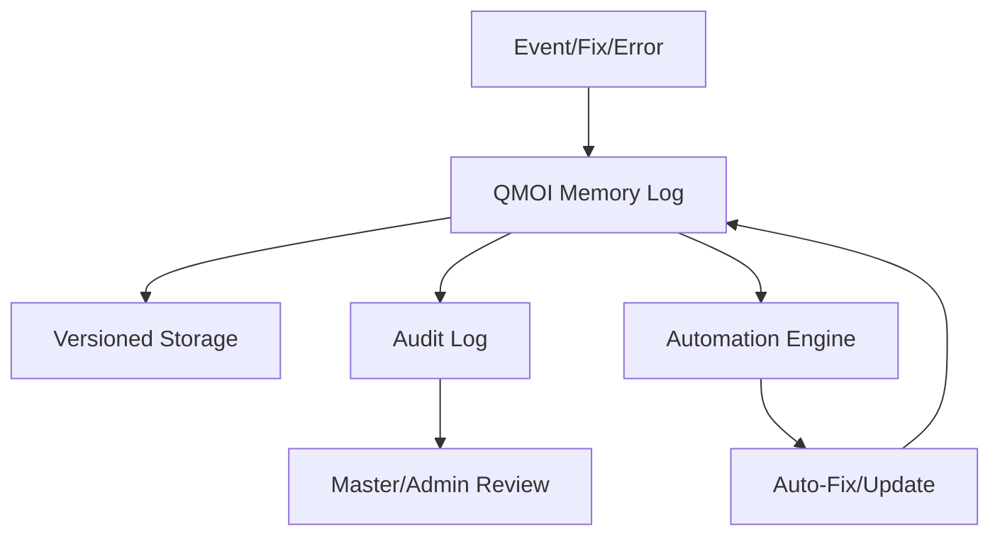

# QMOIMEMORY.md

## QMOI Enhanced Memory System

### Overview
QMOI features an advanced, persistent memory system that ensures it never forgets anything important. All data, conversations, user preferences, project history, and system events are securely saved, versioned, and instantly recallable.

### Features
- **Persistent Memory:** All QMOI data is saved to encrypted, versioned storage (local and cloud).
- **Never Forget:** QMOI remembers all conversations, commands, user preferences, project details, and every fix or action performed—including those in GitLab and QMOI GitLab.
- **Instant Recall:** Any past conversation, file, event, or fix can be recalled instantly by QMOI or the user.
- **Context Awareness:** QMOI uses memory to provide contextually relevant suggestions, reminders, and actions.
- **User Profiles:** Each user’s preferences, learning progress, and history are stored and updated in real time.
- **Project & Fix History:** All project changes, builds, errors, and fixes (including automated and developer/manual fixes in GitLab) are logged, versioned, and can be reviewed or restored.
- **Memory Expansion:** The system is designed to scale with unlimited memory, using cloud and local storage.
- **Data Integrity:** Automatic checks and repairs ensure memory is never lost or corrupted.
- **Privacy & Security:** All memory is encrypted and access-controlled. Users can export, review, or delete their data.
- **Extensible:** New memory modules and features can be added without downtime.
- **Self-Healing & Automation:** QMOI memory can auto-repair, auto-expand, and drive automation for error fixing, updates, and optimization—no developer intervention required.

### Technical Details
- **Storage:** Uses a combination of local database (IndexedDB/SQLite), encrypted cloud storage, and versioned backups.
- **Indexing:** Fast search and retrieval using full-text and semantic indexing.
- **APIs:** Memory APIs allow QMOI and users to query, update, and manage memory.
- **Audit Logging:** All memory access and changes are logged for transparency and compliance.
- **GitLab/QMOI GitLab Integration:** All fixes, error resolutions, deployments, and automation events in GitLab are automatically recorded in QMOI memory for instant recall and audit.

### Memory-Driven Automation
- QMOI leverages its memory to:
  - Instantly recall and reapply past fixes to recurring errors
  - Automate error fixing, deployment, and updates based on historical data
  - Self-heal by detecting and repairing issues using memory logs
  - Optimize workflows and suggest improvements based on past actions
  - Provide developers and masters with audit trails and actionable insights
  - **Universal Language Memory**: Remember optimal language selections for specific tasks
  - **Biometric Memory**: Store and recall biometric authentication patterns
  - **Account Creation Memory**: Track all automatically created accounts across platforms
  - **Password Recovery Memory**: Log all password recovery attempts and success rates
  - **Platform Integration Memory**: Remember successful integration patterns
  - **Error Pattern Memory**: Learn from error patterns to prevent future issues
  - **Performance Memory**: Track performance metrics and optimization strategies
  - **User Preference Memory**: Remember user preferences and customization settings

### Visual Memory Flow

### Future Enhancements
- **Memory Plugins:** Support for custom memory modules (e.g., for specific projects or domains).
- **Cross-Device Sync:** Seamless memory sync across all user devices.
- **Memory Insights:** Analytics and visualization of memory usage, history, and trends.
- **Full Developer-Free Operation:** QMOI will continue to expand automation so all fixes, updates, and optimizations can occur without developer intervention, with master override as needed.

## Memory-Driven Elastic Scaling & Parallelization
QMOI memory powers elastic scaling and parallelization for all runners and devices:
- Remembers past heavy jobs, resource usage, and optimal offload strategies
- Instantly recalls and reuses scaling/offload patterns for new heavy tasks
- Coordinates parallel jobs and auto-balances load across all available resources
- Ensures no artificial limits on job size, file size, or concurrency
- All scaling and parallelization actions are logged and used to improve future automation
- **Language-Specific Memory**: Remember optimal resource allocation for different programming languages
- **Biometric Processing Memory**: Optimize biometric processing based on historical performance
- **Account Management Memory**: Track account creation patterns and success rates
- **Platform-Specific Memory**: Remember platform-specific optimization strategies
- **Error Recovery Memory**: Learn from past error recovery patterns
- **Performance Optimization Memory**: Track and optimize performance across all systems

## Memory-Driven AI/ML Self-Enhancement
- QMOI memory logs all self-improvement, auto-enhancement, and optimization actions
- AI/ML models use memory to learn from past fixes, optimizations, and enhancements
- Memory enables QMOI to auto-update, self-improve, and maintain full control without developer intervention
- **Language Learning Memory**: AI models learn optimal language selection patterns
- **Biometric Learning Memory**: AI models improve biometric recognition accuracy over time
- **Account Creation Learning**: AI models learn successful account creation strategies
- **Password Recovery Learning**: AI models learn effective password recovery patterns
- **Platform Integration Learning**: AI models learn successful platform integration strategies
- **Error Prevention Learning**: AI models learn to prevent errors before they occur
- **Performance Learning**: AI models learn optimal performance configurations
- **User Behavior Learning**: AI models learn user preferences and behavior patterns

## Workspace State, Logs & Audit (2024-06-09)
- QMOI logs all workspace actions (start, stop, clone, sync) for both Gitpod and QMOI-local (Docker) workspaces.
- Real-time status and logs are available in the QCity UI.
- If Gitpod is unavailable, QMOI uses local/ephemeral workspaces and syncs changes back when possible.
- All actions are auditable and tied to master user actions in QCity.

See also: DEVICERESOURCEOPTIMIZATION.md, QMOIAVATAR.md, API.md, QMOIACCOUNTS.md, QMOIAPPS.md, QMOIALWAYSPARALLEL.md, QMOIAICORE.md 