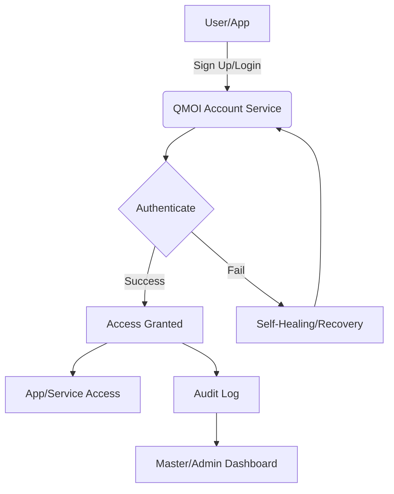

# QMOIACCOUNTS.md

## QMOI Universal Account System

### Overview

QMOI Accounts provide a single, secure identity for users across all QMOI apps, platforms, and services—similar to Google Accounts. This enables seamless login, account management, and automation for both users and developers.

### Key Features

- **Single Sign-On (SSO):** One account for all QMOI apps and services.
- **Cross-Platform:** Use your QMOI account on web, mobile, desktop, and third-party platforms.
- **API & Automation:** Integrate QMOI Accounts into any app or workflow with robust APIs and automation hooks.
- **Master/Admin Controls:** Master users have override, audit, and advanced management capabilities.
- **Security & Privacy:** Encrypted, access-controlled, and compliant with global standards.
- **Self-Healing:** Automated account recovery, provisioning, and error fixing—no developer intervention needed.
- **Audit Logging:** All account actions are logged and visualized for transparency.

### How to Use QMOI Accounts on Any Platform

1. **Sign Up:**
   - Visit any QMOI app or Qstore and select "Sign Up with QMOI Account."
   - Enter your email (e.g., username@qmail.com) and set a password.
   - Optionally, link third-party accounts (Google, Apple, etc.).
2. **Login:**
   - Use your QMOI credentials to log in to any QMOI app or partner platform.
   - Supports SSO, OAuth, and device-based login.
3. **Account Management:**
   - Access your account dashboard to update info, manage devices, and review activity.
   - Master users can view and manage all accounts, with override and audit features.
4. **Developer Integration:**
   - Use QMOI Account APIs to add login/signup to your app.
   - Automate user provisioning, permissions, and account recovery.
   - See API.md for endpoints and usage examples.

### Visual Workflow

### Automation & Self-Healing

- QMOI auto-fixes account issues, recovers lost access, and provisions new accounts as needed.
- Master/admins can trigger or override automation at any time.
- All actions are logged and visualized for compliance and transparency.

### Advanced User Distinction & Recognition

QMOI uses advanced AI-driven identification to recognize and distinguish each user, even across different accounts, devices, or sessions—including when a user is in the background or using another account. This is achieved through:

- **Behavioral Biometrics:** Typing patterns, navigation habits, and device usage.
- **Contextual Signals:** Location, device, time, and app usage context.
- **Multi-Modal Biometrics:** Face, voice, fingerprint, and other biometric data (where permitted).
- **Cross-Session Recognition:** QMOI links user actions and preferences across sessions and accounts, ensuring seamless experience and security.
- **Background Awareness:** QMOI can identify users even when they are not the active account, providing personalized suggestions, security alerts, or automation as needed.
- **Privacy & Security:** All recognition is privacy-respecting, encrypted, and user/audit-controlled. Master/admins can review and override as needed.

#### Automation

- QMOI auto-detects and adapts to user context, switching profiles or providing relevant actions without manual intervention.
- All recognition events are logged and auditable by master/admin.

### Security & Privacy

- All data is encrypted in transit and at rest.
- Users can export, review, or delete their data at any time.
- Master/admins have access to advanced security controls and audit logs.

### See Also

- QMOIMEMORY.md
- QMOIAPPS.md
- Qstore.md
- API.md
