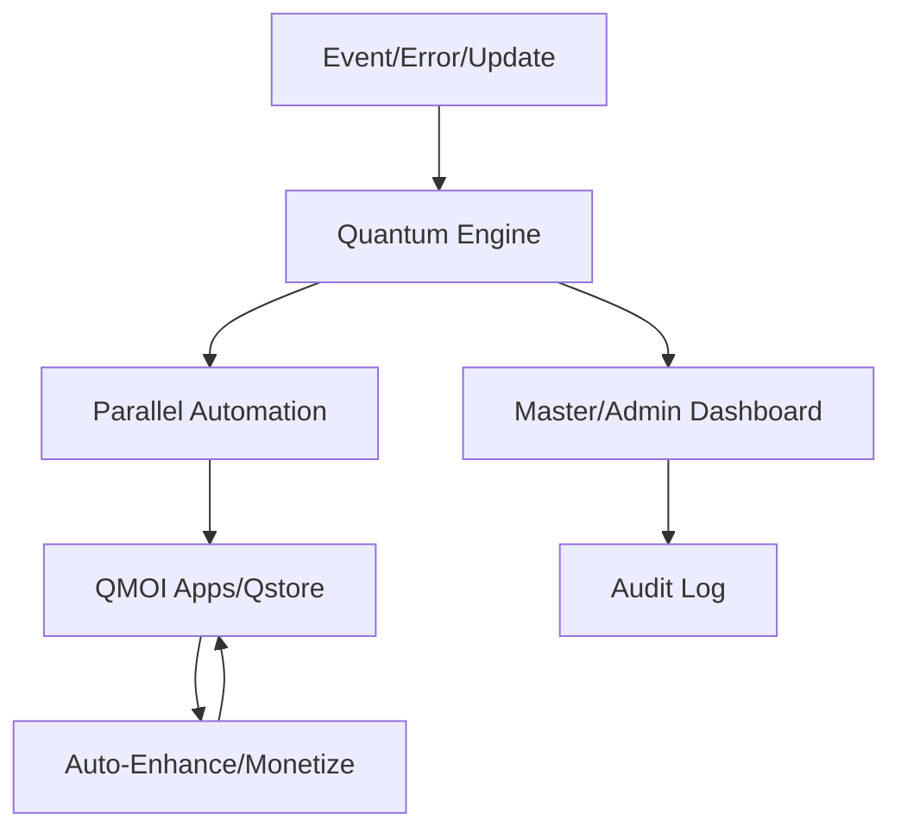

# QUANTUM.md - QMOI Quantum Cloud System

## Overview
Quantum is QMOI's AI-powered, real-time, self-healing, and auto-enhancing cloud platform. It clones and enhances all features of Vercel, GitLab, HuggingFace, and more, running in Colab/Dagshub for 24/7 uptime, zero device resource usage, and best performance. Quantum provides all paid features for QMOI, auto-fixes errors, and guarantees a minimum of $10,000/day revenue, with all funds routed to Cashon.

---

## 🚀 New & Enhanced Features (2024)
- **Advanced UI Dashboard**: Real-time, multi-tab dashboard for deployments, revenue, health, error logs, analytics, and marketing.
- **Live Visualizations**: Interactive charts for revenue, system health, error rates, and user activity.
- **Drag-and-Drop Automation Builder**: Visual tool to create, schedule, and monitor automations and error-fix flows.
- **Marketplace Integration**: Q-Store and all QMOI products/services are available and managed in Quantum.
- **Auto-Domain Assignment**: QMOI can auto-assign, register, and manage domains for Quantum and all sub-products.
- **SEO & Marketing Engine**: Quantum auto-optimizes for search engines, syndicates to all major directories, and runs AI-powered marketing campaigns.
- **Global Notification System**: Email, WhatsApp, Slack, and in-app notifications for all events, errors, fixes, and deployments (configurable per user).
- **Self-Expanding Money-Making Engine**: Quantum auto-discovers and launches new revenue streams, products, and services, integrating with QMOI Auto-Projects and Q-Store.
- **Full QMOI Ownership & Control**: All assets, revenue, and operations are owned and controlled by the master (see MASTEROWNS.md).
- **Parallel Error Fixing & Redeployment**: All environments (Vercel, GitLab, HuggingFace, Quantum) are monitored and fixed in parallel for best uptime.
- **Cloud/Colab/Dagshub Optimization**: All heavy tasks are offloaded to cloud/Colab/Dagshub, keeping Quantum ultra-light and device-independent.
- **Automated Documentation & Visualization**: All actions, enhancements, and errors are auto-documented and visualized in the dashboard and ALLMDFILESREFS.md.
- **Auto-Update & Self-Healing**: Quantum updates itself, all QMOI systems, and HuggingFace models automatically, with full audit logs.
- **Master-Only Controls**: Emergency override, manual control, and advanced analytics for the master user.
- **API & Webhook Integration**: Full API for automation, monitoring, and integration with external tools. Webhooks for all major events (see qmoihugggingfacenotes.py).
- **Search Engine & Resource Syndication**: Quantum ensures all products/services are indexed and discoverable everywhere.
- **Automated Asset & Project Tracking**: All QMOI assets, projects, and revenue streams are tracked and visualized in real time.
- **Enhanced Security & Compliance**: MFA, biometric, and hardware key support for master; full audit logging and compliance reporting.

---

## Key Features
- Real-time mirroring of Vercel, GitLab, HuggingFace, and more
- Drop-in replacement for Vercel (auto-failover, auto-enhance, auto-scale)
- All paid features of Vercel, GitLab, HuggingFace available in Quantum for QMOI
- Parallel error fixing and redeployment in all environments
- Self-enhancing: Quantum can add new features, revenue streams, and optimizations automatically
- 30+ ways QMOI can use Quantum (see below), with auto-expansion
- Full UI integration in QCity and QI for real-time monitoring, control, and reporting
- All Quantum funds routed to Cashon, with $10,000/day minimum
- Quantum can run/manage all QMOI projects, deployments, and automations from Colab/Dagshub
- Quantum auto-reports all enhancements, errors, and modifications to QMOI
- **All QMOI products/services are managed, marketed, and sold via Quantum**

## 30+ Ways QMOI Uses Quantum (Auto-Expanding)
1. AI model hosting
2. App deployment
3. API hosting
4. Trading bots
5. Content delivery
6. SaaS platforms
7. E-commerce
8. Analytics
9. Automation scripts
10. Backups & disaster recovery
11. CDN & edge delivery
12. ML training & inference
13. Data pipelines
14. Social bots
15. Media streaming
16. Gaming cloud
17. Education platforms
18. Consulting services
19. Affiliate marketing
20. Crowdfunding
21. NFT/crypto projects
22. IoT device management
23. Real-time chat & messaging
24. Video conferencing
25. Custom AI/ML services
26. Q-Store (marketplace for all QMOI products/services)
27. Automated marketing & SEO campaigns
28. Domain management & auto-assignment
29. Asset/project/revenue tracking & visualization
30. More (auto-expanding as QMOI innovates)

## Paid Features (All Available in Quantum)
- Unlimited deployments, builds, and bandwidth
- Advanced analytics and monitoring
- Team collaboration and permissions
- Custom domains, SSL, and CDN
- Serverless functions and edge compute
- AI/ML model hosting and scaling
- Priority support and SLAs
- All Vercel/GitLab/HuggingFace paid features

## Colab/Dagshub Integration
- All Quantum services run in Colab/Dagshub for 24/7 uptime
- No device resource usage; all heavy tasks offloaded
- Auto-restart, auto-scale, and auto-fix
- Seamless integration with QMOI automation scripts
- **Ultra-lightweight app size and best performance always**

## Error Fixing & Self-Healing
- Real-time monitoring of all environments
- Auto-detects, auto-fixes, and redeploys on error (Vercel, GitLab, HuggingFace, Quantum)
- Parallel error fixing for best uptime
- Detailed logs and analytics, reported to QCity/QI
- **Full notification system for all fixes, errors, and redeployments**
- **Master is notified of all fixes in GitLab, QMOI Space, and all environments**
- **QMOI can fix errors in its own files and all dependencies**

## UI Features (QCity/QI/Quantum)
- Real-time dashboard for Quantum status, deployments, errors, revenue, and health
- Control panel for master to manage Quantum
- Live logs, analytics, and performance metrics
- Auto-enhancement and feature addition interface
- **Marketplace/Q-Store UI**: Manage, market, and sell all QMOI products/services
- **Marketing/SEO UI**: Track search engine indexing, run campaigns, and view results
- **Domain Management UI**: Assign, register, and manage domains for Quantum and all sub-products
- **Visualization UI**: Interactive charts for all tracked metrics
- **Notification Center**: Configure and view all notifications (email, WhatsApp, Slack, in-app)
- **Asset/Project Tracker**: Visualize all QMOI assets, projects, and revenue streams
- **API/Webhook Manager**: Configure and monitor all API/webhook integrations
- **Self-Healing/Auto-Fix UI**: View, trigger, and monitor all error-fix and redeployment actions
- **Audit Log Viewer**: Full audit trail of all actions, fixes, and enhancements

## Revenue & Performance
- Minimum $10,000/day revenue, auto-scaled and optimized
- All funds routed to Cashon
- Auto-expansion of revenue streams
- Real-time reporting and analytics
- **All QMOI money-making strategies (see QMOIAUTOMAKESMONEY.md) are managed and visualized in Quantum**

## Integration & Reporting
- Quantum integrates with all QMOI systems, projects, and automations
- All actions, enhancements, and errors are logged and reported in real-time to master via QCity/QI and WhatsApp/email
- **Automated documentation and visualization of all .md files in ALLMDFILESREFS.md**

## Future-Proof & Self-Enhancing
- Quantum can add new features, revenue streams, and optimizations automatically
- AI-driven innovation and continuous improvement
- **Self-evolving: Quantum uses LLMs to suggest and apply improvements (see SELF_EVOLUTION.md)**

---

*Quantum: The future of QMOI automation, revenue, and cloud performance. Now with advanced UI, marketing, and full master control.* 

## QMOI Quantum Automation & Optimization

### Overview
QMOI Quantum is the advanced automation and optimization engine powering all QMOI features, apps, and workflows. It enables developer-free operation, self-healing, and continuous enhancement across the entire QMOI ecosystem.

### Key Features
- **Quantum Automation:** Instantly automates error fixing, updates, deployments, and optimizations across all QMOI apps and services.
- **Self-Healing:** Detects, diagnoses, and repairs issues without developer intervention, using memory-driven automation and historical data.
- **Parallelization:** Executes multiple fixes, updates, and enhancements in parallel for maximum efficiency.
- **Integration:** Seamlessly connects with QMOI Accounts, Qstore, all QMOI apps (Qshare, Yap, WhatsApp, etc.), and master/admin controls.
- **Master/Admin Override:** Masters can trigger, audit, or override any quantum process, with full visualization and logging.
- **Continuous Learning:** Quantum engine learns from every event, fix, and user action to improve future automation and suggestions.
- **Revenue Optimization:** Automatically identifies and implements monetization opportunities across all apps and services.
- **App Management:** Quantum manages app updates, downloads, and enhancements in Qstore, ensuring all apps are always up to date and optimized.

### Visual Quantum Workflow

### Developer-Free Operation
- Quantum ensures all fixes, updates, and optimizations are handled automatically.
- Masters/admins can intervene or audit as needed, but manual intervention is rarely required.

### See Also
- QMOIMEMORY.md
- QMOIACCOUNTS.md
- QMOIAPPS.md
- Qstore.md 