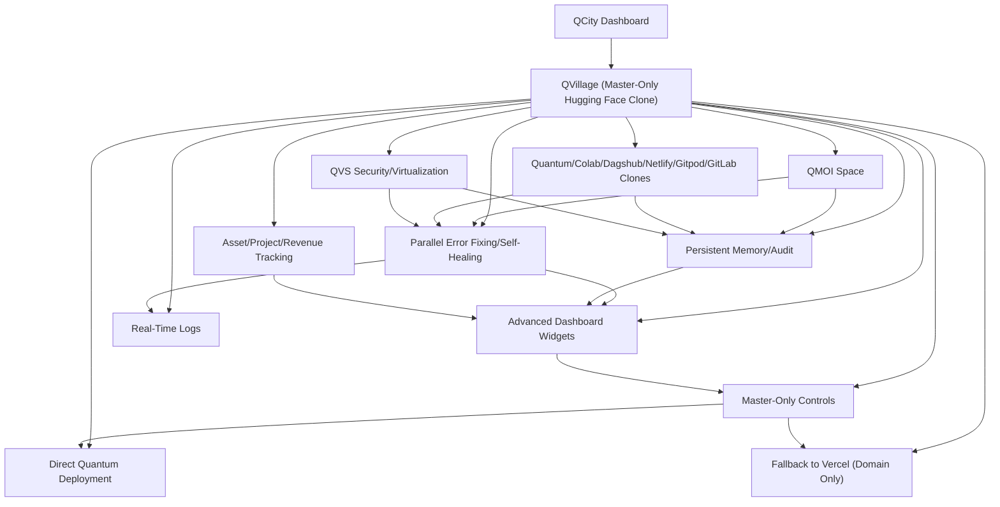

# QVILLAGE.md - QVillage: Master-Only Hugging Face Clone Platform

## Overview

QVillage is the master-only Hugging Face clone platform, fully integrated with QMOI. It provides advanced model, space, dataset, and inference management, parallel error fixing and self-healing, persistent memory and audit, and is the central hub for all AI/ML operations in QCity.

## Key Features

- Advanced model, space, dataset, and inference management
- Parallel error fixing and self-healing (across all platforms)
- Persistent memory and audit logs (view/export)
- Quantum/Colab/Dagshub/Netlify/Gitpod/GitLab clones as primary platforms (never actual ones)
- HuggingFace auto-update and model training/visualization
- QVS security/virtualization integration
- Master-only controls for all advanced features
- Real-time logs and job queue
- Asset/project/revenue tracking (charts, logs)
- Advanced dashboard widgets for all platforms
- Direct Quantum deployment (status, controls)
- Fallback to Vercel only for domain (status, controls)
- Enhanced UI in QCity (see QVillage.tsx)
- Cross-links to all .md docs

## 1. QMOI Space Integration

QVillage provides a dedicated panel for managing QMOI Space: advanced AI, batch processing, API endpoints, model configuration, training, auto-update, and real-time logs/visualization. All actions are parallelized and auditable. See QMOISPACE.md, QMOISPACEDEV.md.

## 2. Quantum/Colab/Dagshub/Netlify/Gitpod/GitLab Clones

QVillage manages all automation, error fixing, and deployment using QMOI's own clones of these platforms. Status, logs, controls, and parallel job queues are visualized in real time. See QMOIALLPLATFORMS.md, QUANTUM.md.

## 3. HuggingFace Auto-Update/Model Training

QVillage auto-updates and trains models on HuggingFace, with visualization, logs, and controls for all jobs. All updates are parallelized and logged. See QMOIHUGGINGFACEALWAYSUPDATE.md, QMOISPACEDEV.md.

## 4. QVS Security/Virtualization

QVillage integrates QVS for security, virtualization, and compliance. Status, controls, and compliance dashboards are provided. See QVSREADME.md, ENHANCEDQVS.md.

## 5. Parallel Error Fixing/Self-Healing

All error fixing and self-healing jobs are managed in parallel, with job queues, logs, and controls. Master can override or audit any job. See QMOIALWAYSPARALLEL.md, QMOIQCITYAUTOMATIC.md.

## 6. Master-Only Controls

Elastic scaling, override, persistent memory, audit logs, and export features are available only to master users. All actions are logged and auditable. See QMOIREADME.md, QCITYRUNNERSENGINE.md.

## 7. Persistent Memory/Audit

All actions, jobs, and changes are logged in persistent memory and audit logs, viewable and exportable from the UI. See QMOIMEMORY.md, ALLMDFILESREFS.md.

## 8. Asset/Project/Revenue Tracking

QVillage provides charts, logs, and analytics for all assets, projects, and revenue streams managed by QMOI. See QMOIREADME.md, QMOI-REVENUE-README.md.

## 9. Advanced Dashboard Widgets

All platform features are visualized with advanced widgets, real-time status, and logs. See QMOI-ENHANCED-AUTOMATION.md, QMOIALLPLATFORMS.md.

## 10. Direct Quantum Deployment

QVillage enables direct deployment to Quantum, with status and controls. See QUANTUM.md.

## 11. Fallback to Vercel (Domain Only)

Vercel is only used for domain management if needed; all other features use QMOI clones. See QMOIALWAYSPARALLEL.md, QMOIALLPLATFORMS.md.

## 12. Enhanced UI in QCity

All QVillage features are accessible from the QCity dashboard, with master-only access for advanced controls. See QCityDashboard.tsx, QVillage.tsx.

## 13. Cross-Links

See also: QMOIALWAYSPARALLEL.md, QMOIFREE.md, QMOIALLPLATFORMS.md, QMOIQCITYAUTOMATIC.md, QMOISPACE.md, QMOISPACEDEV.md, QMOIREADME.md, QCITYRUNNERSENGINE.md, QVSREADME.md, ENHANCEDQVS.md, ALLMDFILESREFS.md.

## Usage Example

- Access QVillage from QCity dashboard (master only)
- Manage models, spaces, datasets, inference endpoints
- Monitor and control parallel error fixing/self-healing jobs
- View persistent memory, audit logs, and analytics
- Deploy directly to Quantum, fallback to Vercel for domain if needed
- All features are visualized and controlled via the enhanced QVillage UI
